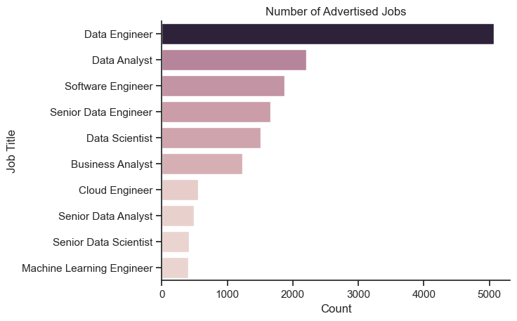
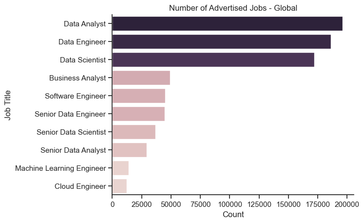
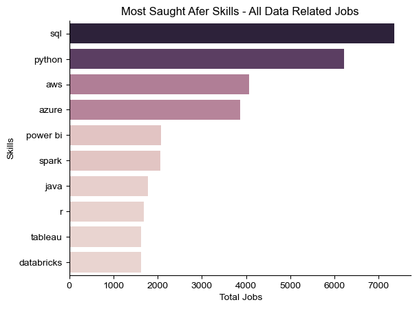
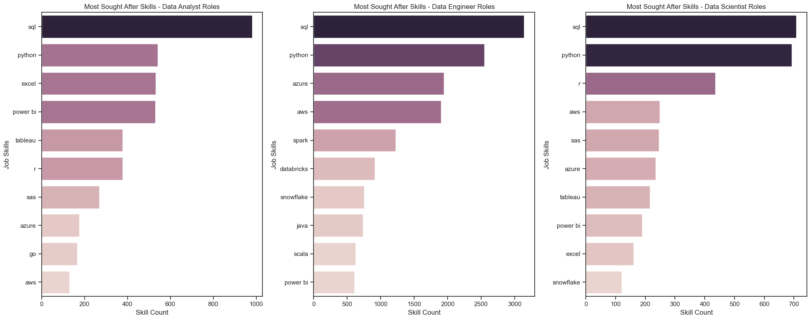
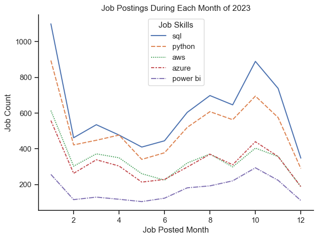
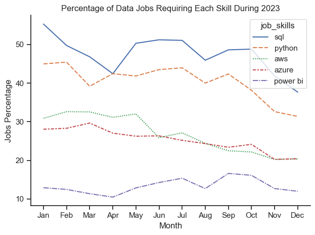

# Project Overview 

 Entering the world of data is often a daunting experience for new applicants. It feels like getting lost in a maze where every exit is shrouded in confusing job titles, and every path feels like a never-ending spiral riddled with pythons, pandas, the Tidyverse and everything in between. This project aims to make this pathway clearer by answering the following questions:
 
- Which data-related skills are the best to learn first?
- Before delving into learning new skills, should you choose a data career pathway?
- Which career path will have the most job opportunities for a new applicant in Australasia, and how does it compare to overseas opportunities? 
- Are any of the top skills trending towards becoming obsolete?


The case study conducted in the following Jupyter notebooks: 
- [Exploratory Data Analysis](job_skills_eda.ipynb)
- [Job Skills Trends](job_skills_trends.ipynb)

# Tools Used 
The following tools were used for this project: 

**- Python** -  main programming language used for the project
- Pandas Library - data manipulation, cleaning and analysis 
- Matplotlib Library - data visualisations 
- Seaborn Library - tools used to enhance the visualisations 

**- Visual Studio Code**  - Integrated development environment/ code editor

**- Jupyter Notebook** - Used to run the python scripts (via VS Code)

**- Git and Github** - Version control, sharing the code online 

# Data Cleaning and EDA

An initial exploration of the dataset was conducted to locate areas for data cleaning and to get a better understanding the basic structure, patterns and relationships within a dataset. This part of the project can be found in the following jupyter notebook: [EDA](job_skills_eda.ipynb)

The following packages were imported for this step: 
``` python
import pandas as pd
import matplotlib.pyplot as plt 
import seaborn as sns
from datasets import load_dataset
```

## Data Structure 
Getting a overview of the dataset by running the head(), info(), and details() methods on the data frame. A summary of the dataset is below: 

Index: 15409 entries, 90 to 785687
Data columns (total 17 columns)
dtypes: bool(3), datetime64[ns](1), float64(2), object(11)


## Cleaning the Data
The following steps were taken to clean the data. Basic cleaning was done prior to the EDA phase and specific data cleaning steps were taken during the in-depth analysis phase: 
- Dropping the duplicate rows. 
- Converting the 'job_post_date' column into datetime type.
- Creating a new filtered data frame with job postings from only New Zealand and Australia and assigning it to the variable 'df_anz'.
- Assigning a name to the data frame index.
- Resetting the index for 'df_anz'.
- Converted the type of each row in the Job Skills column from string to list using the 'literal_eval' function in the 'ast' module
- Split each item in the list into individual rows using the 'explode' method on the data frame.


# Exploratory Data Analysis and Visualisations 
### Using the Matplotlib and Seaborn packages to plot a summary of the advertised jobs: 

```python
sns.set_theme(style = 'ticks')
sns.barplot(data=job_title_counts, x='count', y='job_title_short', hue = 'count', legend = False)
sns.despine()  
plt.xlabel("Count")
plt.ylabel("Job Title")
plt.title("Number of Advertised Jobs")
plt.show()
```



### How do global job stats compare to the NZ and Australia data?



### Insights: 
- Data engineer roles were the most frequently listed in New Zealand and Australia in 2023. 
- Data analysts were more in demand in 2023 than software engineers and data scientists. 
- There was a low demand of machine learning engineers compared to other data related roles. 


### Using the Matplotlib and Seaborn packages to plot a summary of the advertised jobs:


```python
fig, ax = plt.subplots(1, 2, figsize=(12, 8))  

column_dict = {
    'job_work_from_home': 'Work From Home?',
    'job_no_degree_mention': 'Degree Required?'
}

for i, (column, title) in enumerate(column_dict.items()):
    ax[i].pie(df_anz[column].value_counts(), startangle=90, autopct='%1.1f%%', labels=['No', 'Yes'], colors=sns.color_palette("PuBu"))
    ax[i].set_title(title)

plt.show()
```

### Insights: 
- Only 5.2% of the roles offered a work from home option on the job listing while only 48.5% required a the applicants to have a degree.   
- However, it is important to note the possible limitations of this dataset since the data was collected via web scraping. The jobs with a work from home option or a degree requirement may not have listed this online.

# Detailed Insights and Trend Analysis 
This part of the project can be found in the following Jupyter Notebook file:
[Job Skills Trend Analysis](job_skills_trends.ipynb) 


### What are the most sought after skills for data analyst, data engineer and data scientist roles in Australia and New Zealand?
This required a two-step cleaning process to get the 'df_anz' data frame ready for analysis:

- Converted the type of each row in the Job Skills column from string to list using the 'literal_eval' function in the 'ast' module
- Split each item in the list into individual rows using the 'explode' method on the data frame.  

**1. finding the most sought after skills in Australian and New Zealand for all data related jobs in the dataset** 

```python
sns.barplot(data = top_skills_count, x = 'count', y = 'job_skills', hue = 'count', legend = False)
sns.set_theme(style= 'ticks')
sns.despine()
plt.xlabel(' Total Jobs')
plt.ylabel('Skills')
plt.title("Most Saught Afer Skills - All Data Related Jobs")
```


**2. Breaking down the most sought after skills into data analyst, data engineer and data science roles** 
'
 ```python 
 job_titles = ['Data Analyst', 'Data Engineer', 'Data Scientist']
no_of_skills = 10

fig, axes = plt.subplots(1, 3, figsize=(20, 8))

for i, job_title in enumerate(job_titles):
    df_skill_specific = df_skill_breakdown[df_skill_breakdown['job_title_short'] == job_title].head(no_of_skills)
    
    sns.barplot(data=df_skill_specific, x='skill count', y='job_skills', hue='skill count', ax=axes[i], dodge=False, legend=False)
    
    axes[i].set_xlabel('Skill Count')
    axes[i].set_ylabel('Job Skills')
    axes[i].set_title(f'Most Sought After Skills - {job_title} Roles')

plt.tight_layout()
plt.show()
```


### Insights:
- The two most sought after skills were SQL and Python, across the three job types of data analyst, data engineer and data scientist. 
- Excel and Data visualisation tools such as Tableau and Power BI were more important for data analyst roles, when compared to the other two job types. 
- Knowledge of the coding language R was beneficial for data science roles, but it was not amongst the top 5 most requested skills for data analyst or data engineer roles.
- Experience with cloud computing platforms such as Azure and AWS were highly requested for data engineer roles, but it was lower in the priority for data analyst or data science roles. 


## Trend Analysis 
Due to the limitations of the data, it was only possible to explore how the job postings trended during 2023. However, the visualisation still provides insight into how job postings trend during different part of the year: 

```python 
sns.lineplot(data= skills_pivot_top_5)
sns.despine()
plt.tight_layout()
plt.xlabel('Job Posted Month')
plt.ylabel('Job Count')
plt.title('Job Postings During Each Month of 2023')
```



## Insights: 
- Demand for all of the top 5 skills trended in a similar manner throughout the year. There were no significant outliers in this trend. 
- SQL and Python remained the most requested skills throughout the whole year.

**To get a better understanding of the trend in relation to the number of jobs posted, the data frame was adjusted to show the percentage chance of a job posting requesting each skill. To further clarify the plot, the job posted month was relabelled to a string**

```python
skills_pivot_perc = skills_pivot_perc.reset_index()

skills_pivot_perc['job_posted_month'] = skills_pivot_perc['job_posted_month_no'].apply(lambda x: pd.to_datetime(f"2022-{x:02d}-01").strftime('%b'))

skills_pivot_perc = skills_pivot_perc.set_index('job_posted_month')
skills_pivot_perc = skills_pivot_perc.drop(columns='job_posted_month_no')
```

```python 
sns.lineplot(data = skills_pivot_perc_top)
plt.xlabel('Month')
plt.ylabel('Jobs Percentage')
plt.title('Percentage of Data Jobs Requiring Each Skill During 2023')
plt.tight_layout()
sns.despine()
```



### Insights
- The plot shows a general decline in the percentage of jobs mentioning a requirement for the top four data skills. 
- Despite being the fifth popular choice, the percentage of roles requiring Power BI experience has remained consistent through the year. 

# Key Findings
Based on the analysis, Python and SQL emerged as the most in-demand skills across data analyst, data engineer, and data scientist roles in Australia and New Zealand in 2023. Focusing on these two skills would provide aspiring professionals with a versatile foundation to succeed in the data field while allowing flexibility in career choices.

Data engineer roles were the most frequently advertised positions in 2023, indicating a logical starting point for individuals aiming to maximize job opportunities. However, these findings were not consistent with the global data, which revealed that data analyst roles were the most listed in 2023. 

Finally, the analysis explored trends in the popularity of top-requested skills. While job advertisements showed seasonal fluctuations, there were no significant shifts in the demand for the top skills over time.

Overall, these insights offer valuable guidance for both job seekers and stakeholders in the data job landscape.


